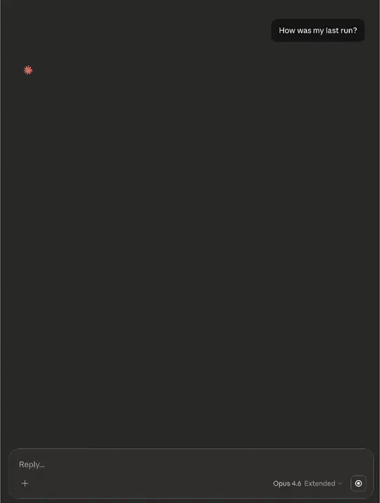
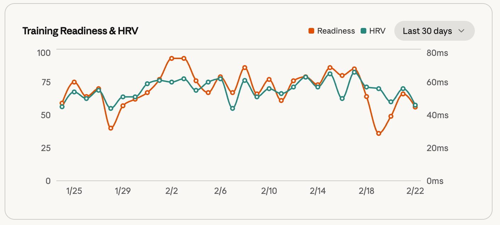

Like many, since Dec 2025, I have switched my daily workflow from typing in VSCode to using only prompts to complete daily tasks.

I have had several weekend projects, like [0ma](https://github.com/chenhunghan/0ma), for managing local VMs, and [scim-mcp](https://github.com/chenhunghan/scim-mcp), an MCP server that proxies requests to SCIM endpoints. Most of them were for fun, just wanted to see how far I can push LLMs to their limits, using only natural language.

This time I want to build something different: [Garmin MCP Apps](https://github.com/chenhunghan/garmin-mcp-app) that can be installed on ChatGPT Desktop or Claude Desktop, and interact with the data from your watch with a generative UI that is intended for a non-technical audience.

This app allows users to not only query data from your Garmin watch, but also play with dynamic visualisation charts to explore your workout data, without giving out who you are or your credentials to the AI.

The target users are serious runners who want to utilise the power of LLMs to plan for their next workout. The Garmin mobile app is awesome, but it is general-purpose, targeting more general users, a few years behind the latest developments in sport science. I feel like I always want to customise some parameters/dashboard. With MCP Apps, there is no interface that is more flexible than natural language + generative UIs.

Running, not AI, in the past few years, has changed my life. I wish to bring this positive impact to more users. With the integration of LLMs and cutting-edge sport science, more users will actually start to enjoy running, and become runners.

The only problem is I have young kids, so I have very limited time during the weekends. Eventually I managed to make the initial version in 12 hours, so here are the tips worth documenting.

## Use Frontier Model

Do not waste your time on older, smaller models, even if they are cheaper. Always use the best model on the market. However, there are exceptions: when I started this project, I started with Antigravity + Gemini Pro 3.1 because it was the newest, but sorry, Google, this model is not the best, not even the second best. I ended up using Opus 4.6 with Claude Code. The time you waste in an agentic loop with a weak model will cost more than the cost of tokens from the frontier model.

## The Best Context Engineering is No Context Engineering

Let me repeat: the best context engineering is no context engineering. Context engineering, in essence, is to give an LLM access to context it might not otherwise have. For example, give browser CDP access to an LLM using the MCP or skill you prefer so the LLM has access to the DOM to inspect the elements. However, if you want to go fast, you should completely skip the context engineering part, and the best way to take a shortcut is to use the most popular language/framework on the market.

You might not like React, you might not like TypeScript, you might not like Tailwind, and you are probably smart enough to build your own lib that completely avoids the re-renders on state updates or is "truly reactive" compared to React. However, LLMs are trained on internet data (and pirated books); reinventing the wheel means you need to do extra context engineering to prompt-engineer the LLM. That works, but is not the optimal way to speed things up. So choose the most popular. For UI, there is nothing that can compare to React/Tailwind in terms of market share.

## Harness Engineering

Harness engineering is similar to context engineering, however instead of giving more data to the LLM, harness engineering is more about making it easier for LLMs to modify your code. Claude Code is an excellent example of good harness engineering; with it, LLMs can modify large amounts of code without making errors, unlike Gemini Pro 3.1 struggling with Antigravity.

Claude Code's hook system makes harness engineering easy. I have made two Claude Code plugins: ralph-hook-fmt, which automatically formats files after they are written or edited, inspired by Formatters in OpenCode; and ralph-hook-lint, which automatically emits lint errors when Claude Code finishes one loop of editing. Both plugins speed up the feedback loop in the agentic loop, so the LLM can react automatically after files are edited and static analysis detects problems. Those two hook plugins are still in early phases, but give them a try or make your own hook.

## Plan First

Use your favourite planning tool, no matter if it is from Superpower, Speckit, or the built-in Claude Code plan tool. In plan mode, always ask Claude to relentlessly question you to fill the gaps in the plan. Stay in plan mode until you feel comfortable to let go. Planning is recommended early as the model is smarter in the first few thousand tokens of the context window. Making explorations and clarifications, then forking out from plan mode into implementation mode, will make the implementation more concentrated and focused without reading unnecessary files to stuff the context window.

## Use Sub-agents

Sub-agents are useful when you want to do things in parallel, e.g. exploring an unknown code base. LLMs are smarter in the first 0–30% of the context window. Use sub-agents to explore a code base and give back the summary to the main context; this will keep the main context lean and not polluted with tool calls, avoiding losing the "Needle-in-a-Haystack".

Use sub-agents to write code, but only when the structure of the project is stable. Give tasks to sub-agents when you know exactly the boundaries of the task. One example is when you have a chart that already has a pattern to feed data into, and has known patterns to style the chart using shared CSS variables. Sub-agents are good when you know the exact output, for example, making a chart for each API endpoint following an example chart pattern.

## Worktree, Worktree, Worktree

Claude Code has native support for git worktree now; start the worktree by `claude --worktree`. However, like sub-agents, I would suggest using worktree only when the structure starts to stabilise, and there is no, or little, ambiguity in the requirements. Worktree is for self-contained, fully isolated features or bug fixes that have clear boundaries. You probably do not want to use worktree to add a feature that touches all files; you will end up spending more time resolving conflicts. Do it on the main branch. Worktree is for predictable tasks that you are sure will be finished in a known timeframe.

Finally, thanks for reading through to here — your attention span is longer than most humans'. Give [Garmin MCP Apps](https://github.com/chenhunghan/garmin-mcp-app) a try, let it help you plan for the next optimal run. Most importantly, start running. AI might change the world but not our everyday life; running (or whatever exercise you are into) will change your life.
